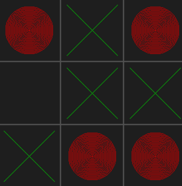

# Tic-Tac-Toe Neural Network AI (C/SDL) 🤖❌⭕

A simple Tic-Tac-Toe game with a neural network AI, written in C using SDL2 for graphics. The AI trains itself via self-play and then challenges you in a classic 3x3 grid. Play as X, and see if you can beat the AI!

---

## Features ✨
- 🤖 Neural network AI learns to play Tic-Tac-Toe via self-play
- 🖥️ Playable GUI using SDL2
- 🏆 Detects wins, losses, and draws
- ⚡ Fast, fun, and minimalistic

---

## Screenshot 📸


---

## How to Build & Run (MSYS2 MinGW64) 🛠️

1. **Install dependencies:**
   - SDL2 (and SDL2-devel)
   - GCC (MinGW-w64)

2. **Open MSYS2 MinGW64 shell** and run:

```sh
pacman -S mingw-w64-x86_64-gcc mingw-w64-x86_64-SDL2
make
```

3. **Run the game:**

```sh
./neuralnet.exe
```

> ⚠️ If you want to run it as `./neuralnetwork.exe`, edit the `Makefile` and change the output name from `neuralnet.exe` to `neuralnetwork.exe`.

---

## File Structure 🗂️
- `main.c`         — Main game loop, SDL2 UI, and neural network training
- `neuralnet.c/h`  — Neural network implementation
- `matrix.c/h`     — Matrix math utilities
- `Makefile`       — Build instructions
- `README.md`      — This file

---

## Controls 🎮
- **🖱️ Left Click:** Place your X on the board
- **🤖 AI (O) moves automatically**

---

## License 📄
MIT License. See `LICENSE` file if present.

---

Enjoy playing and hacking the code! 🚀
